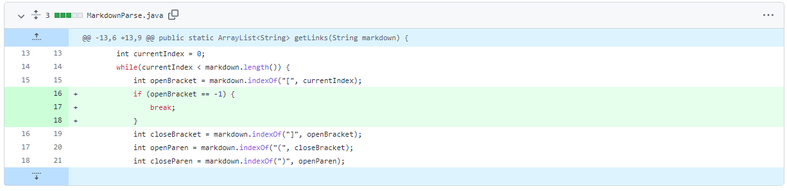
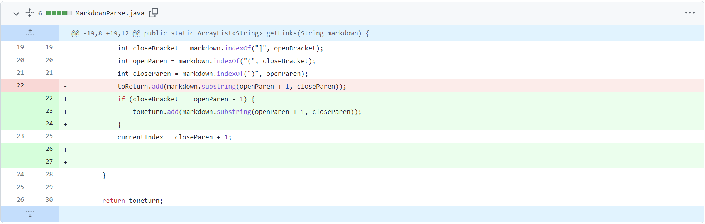
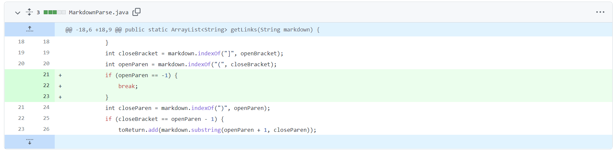

# Lab Report 2

**Change 1 (From Darrius, Alexander, and  Andrew)**

[Test File 1 for a failure-inducing input](test-file1.md)

Symptom
PS C:\Users\boyan\OneDrive\文档\GitHub\Fork-markdown-parser-original> java MarkdownParse test-file1.md 
Exception in thread "main" java.lang.OutOfMemoryError: Java heap space
        at java.base/java.lang.StringLatin1.newString(StringLatin1.java:766)
        at java.base/java.lang.String.substring(String.java:2708)
        at MarkdownParse.getLinks(MarkdownParse.java:19)
        at MarkdownParse.main(MarkdownParse.java:30)

The symptom of the program is that the system is crashing and goes out of memory. The bug is that the program goes into a infinite loop if it cannot find the first openBracket.

**Change 2 (From Darrius, Alexander, and  Andrew)**

[Test File 1 for a failure-inducing input](test-file2.md)

Symptom
PS C:\Users\boyan\OneDrive\文档\GitHub\Fork-markdown-parser-original> java MarkdownParse test-file2.md
Exception in thread "main" java.lang.OutOfMemoryError: Java heap space
        at java.base/java.lang.StringLatin1.newString(StringLatin1.java:766)
        at java.base/java.lang.String.substring(String.java:2708)
        at MarkdownParse.getLinks(MarkdownParse.java:19)
        at MarkdownParse.main(MarkdownParse.java:30)

The symptom of the program is that the system is crashing and goes out of memory. The bug is that the program goes into a infinite loop if the openParen is not next to the closeBracket, like in the test file.

**Change 3 (From Darrius, Alexander, and  Andrew)**

[Test File 1 for a failure-inducing input]

Symptom
PS C:\Users\boyan\OneDrive\文档\GitHub\Fork-markdown-parser-original> java MarkdownParse test-file3.md
Exception in thread "main" java.lang.StringIndexOutOfBoundsException: Range [0, -1) out of bounds for length 21
        at java.base/jdk.internal.util.Preconditions$1.apply(Preconditions.java:55)
        at java.base/jdk.internal.util.Preconditions$1.apply(Preconditions.java:52)
        at java.base/jdk.internal.util.Preconditions$4.apply(Preconditions.java:213)
        at java.base/jdk.internal.util.Preconditions$4.apply(Preconditions.java:210)
        at java.base/jdk.internal.util.Preconditions.outOfBounds(Preconditions.java:98)
        at java.base/jdk.internal.util.Preconditions.outOfBoundsCheckFromToIndex(Preconditions.java:112)
        at java.base/jdk.internal.util.Preconditions.checkFromToIndex(Preconditions.java:349)
        at java.base/java.lang.String.checkBoundsBeginEnd(String.java:4589)
        at java.base/java.lang.String.substring(String.java:2703)
        at MarkdownParse.getLinks(MarkdownParse.java:19)
        at MarkdownParse.main(MarkdownParse.java:30)

The symptom of the program is that the index goes out of bounds. The bug is that system cannot find openParen if there is no openParen in the test file.
