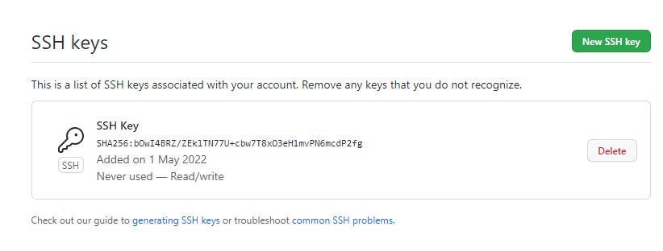
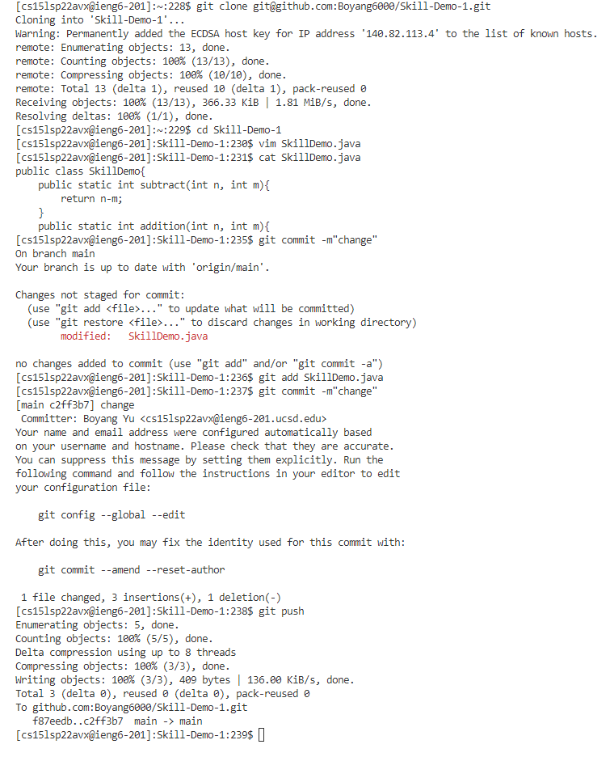
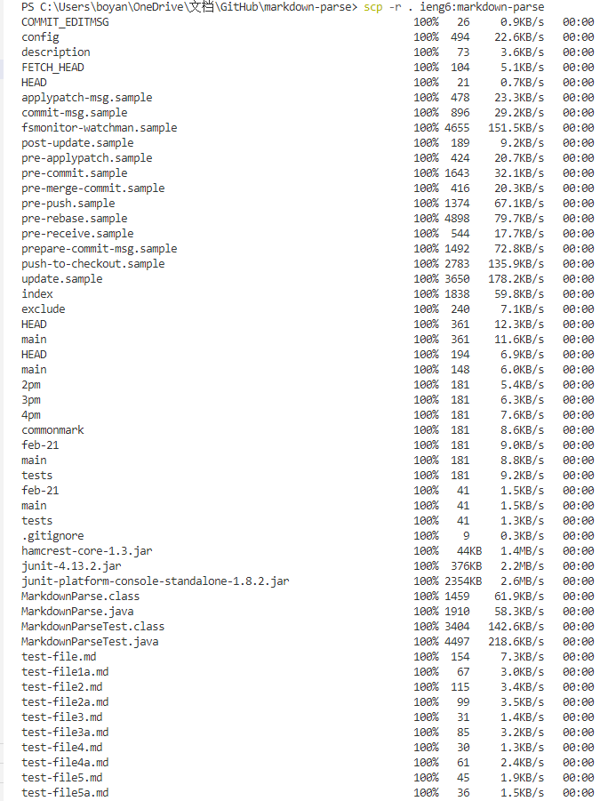
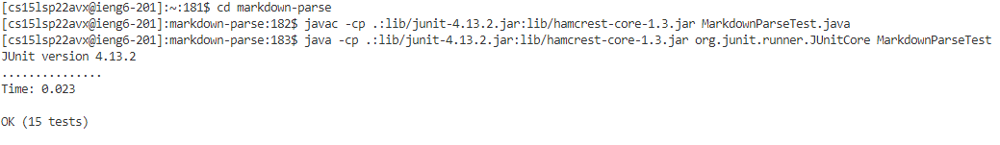
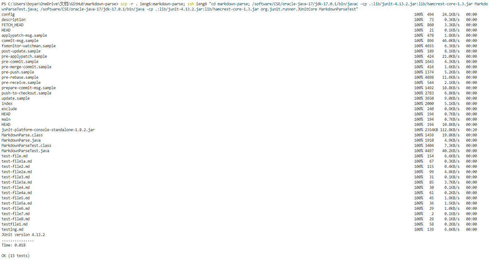

# Lab Report 3

## Streamlining ssh Configuration ##

## Setup Github Access from ieng6 ##

[Link](https://github.com/Boyang6000/Skill-Demo-1/commit/c2ff3b7997c12d987716c53bf2c2802a40f2d85a)

## Copy whole directories with scp -r ##

