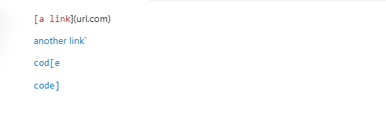
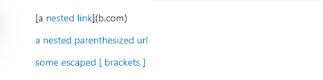
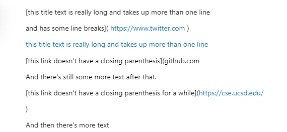
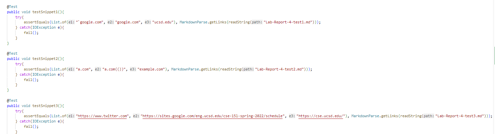
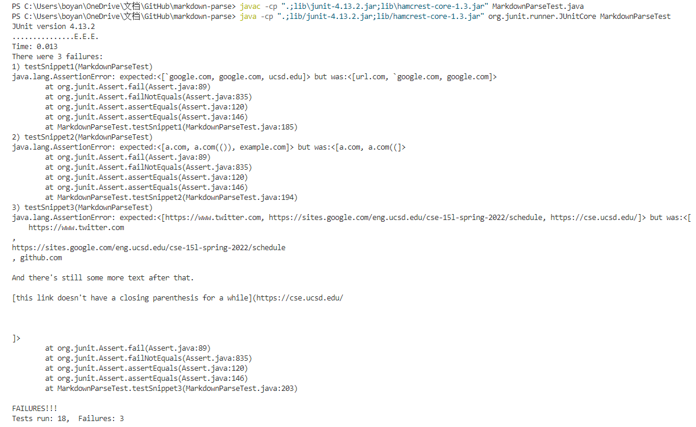
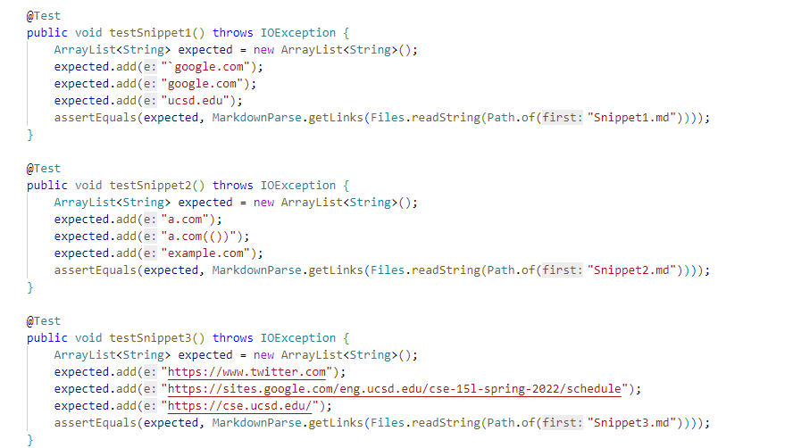
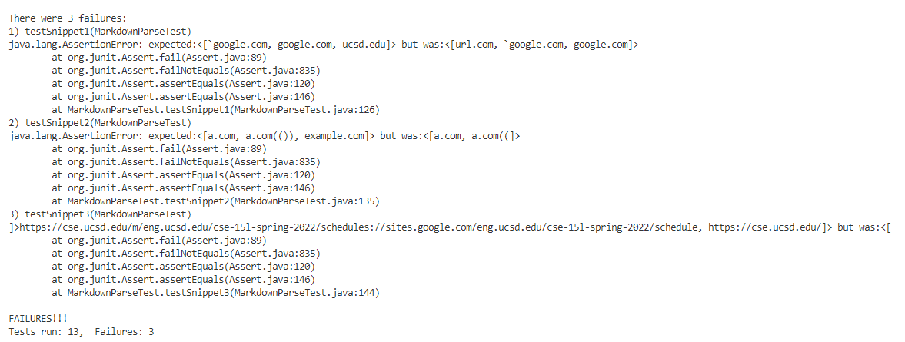

# Lab Report 4

[My Markdown-Parse Repository](https://github.com/Boyang6000/markdown-parse)

Preview for Snippet 1

Preview for Snippet 2

Preview for Snippet 3

;

Code for Test

Test Result

Test for three Snippets did not pass.

[Reviewed Markdown-Parse Repository](https://github.com/chw081/markdown-parser.git)

Preview for Snippet 1

Preview for Snippet 2

Preview for Snippet 3

;

Code for Test

Test Result

Test for three Snippets did not pass.

**Answers To The Questions**

1. I do not think small code change can make my program work for Snippet 1 because first we want to make sure that there is nothing before the open bracket. Also, I feel we might need to add while loop to target on the last close bracket which we want to compare with the open parenthese. 

2. I do not think small code change can make my program work for Snippet 2 because we still need while loop to go through the whole line and determine the last close bracket which is before the last open parenthese.

3. I do not think small code change can make my program work for Snippet 3, which is the most complicated one. We need to add code so that the program can check the next line if close Bracket or close Parenthese does not show up in the same line of open Bracket or open Parenthese. Also, we need to check to see if close Bracket or close Parenthese is missing after searching a few lines.