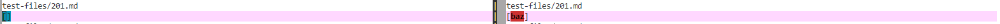
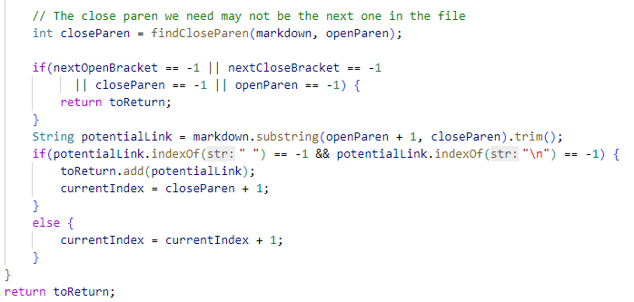

# Lab Report 5

Process of finding tests with different results

1. Clone my own repository and the repository provided in Week 9 Lab into my ieng6.

2. Copy 652 tests from the repository provided in Week 9 Lab into my own repository.

3. Run script.sh in my own repository and copy all the result into result.txt.

4. Use vimdiff to compare different results.

Two Tests with different result

1. [Test 194](https://github.com/nidhidhamnani/markdown-parser/blob/main/test-files/194.md)

2. [Test 201](https://github.com/nidhidhamnani/markdown-parser/blob/main/test-files/201.md)

Test 194

1. My implemention is correct.

2. Actual Output

3. Expect Output should be []

Test 201

1. My implemention is correct.

2. Actual Output

3. Expect Output should be []

Describe the Bug

Here is part of code that needs to be changed.

Code change for Test 194 needs to add a code to check if there is multiple close bracket. If there is multiple close bracket, then there will be no link. 

Code change for Test 201 needs to add a if condition to test if there is a dot in between open parenthese and close parenthese. In Test 201, there is no dot in parenthese, which means that baz cannot be a link.

