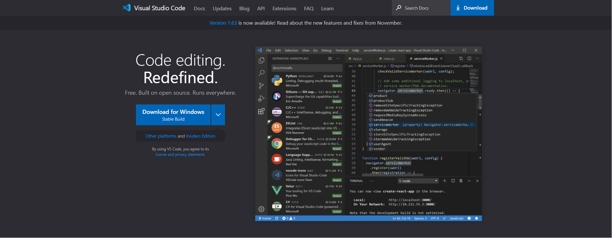
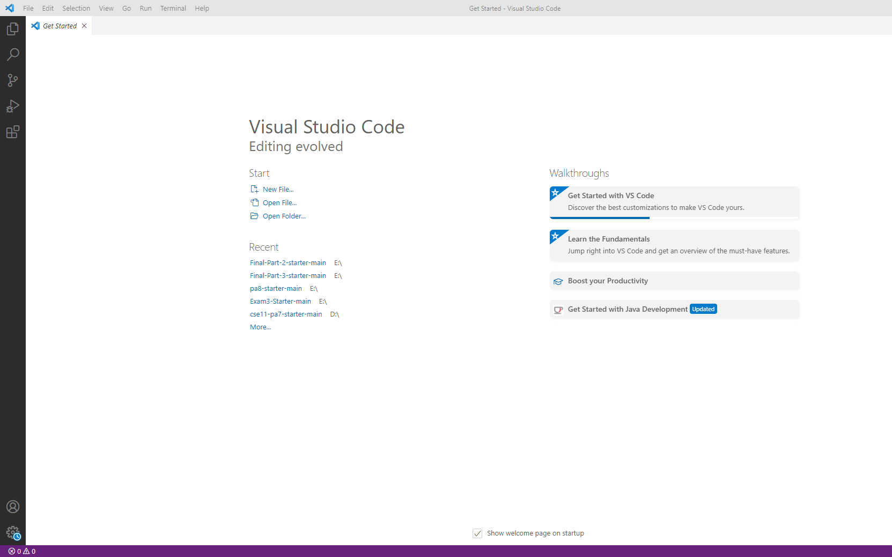
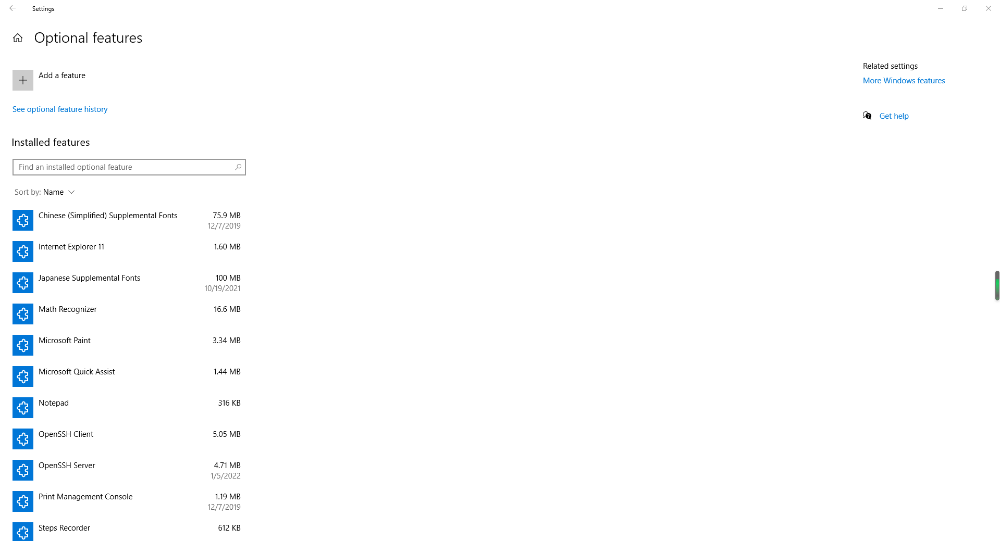
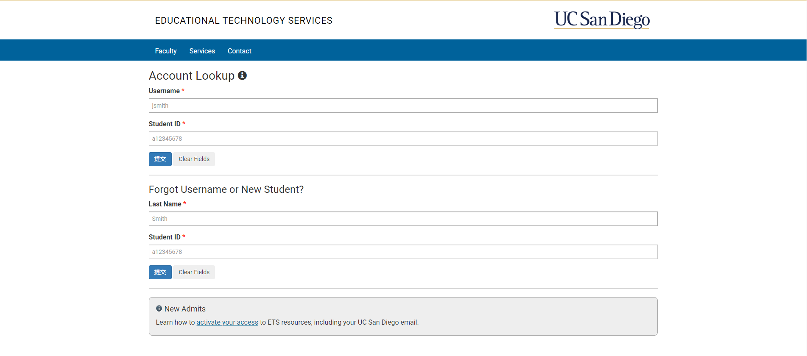
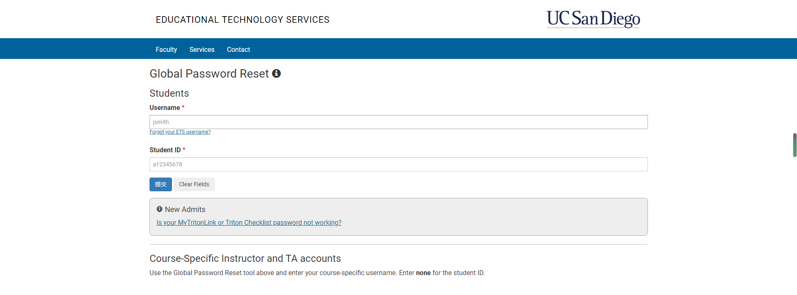
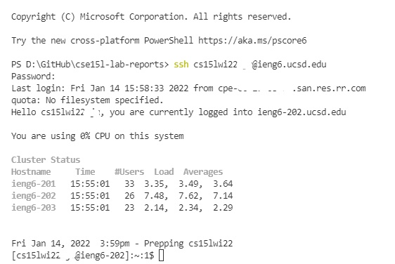
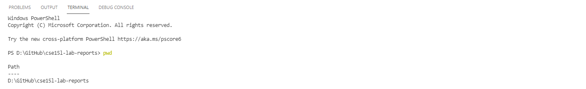
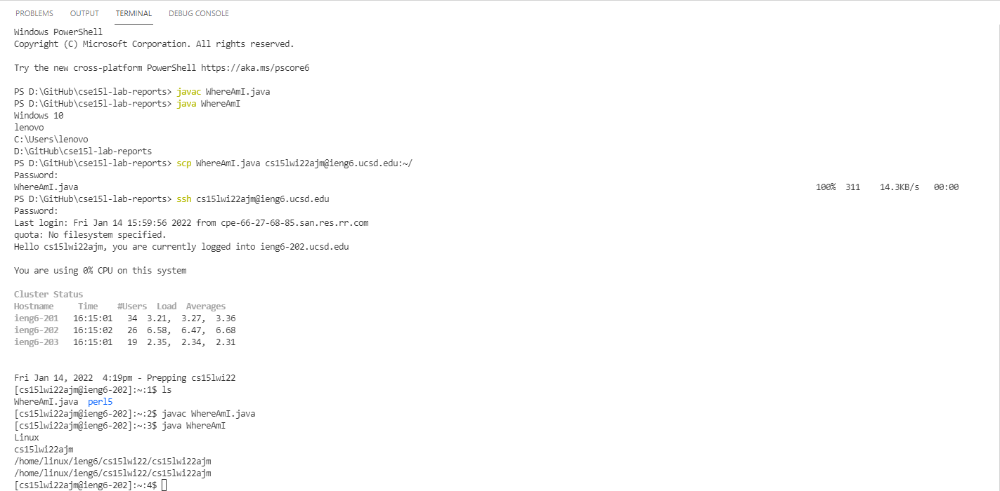

# Week 2 Lab Report

* **Installing VScode**
    
    Follow the instruction on VScode website and download VScode.
    
    [VSCode Download](https://code.visualstudio.com/)

    

    After installed, you should be able to open it and it looks like this:
    
    
    

* **Remotely Connecting**
    1. Install *OpenSSH*, which you can see from *Setting* -> *APP* -> *Apps & Features* -> *Optional Features*. Install *OpenSSH Client* and *OpenSSH Server* if you do not 
       have these on your computer.
       
       [Tutorial](https://docs.microsoft.com/en-us/windows-server/administration/openssh/openssh_install_firstuse)

       
       
    2. Look up for your special account for *CSE15L*. Change the password for your special account of *CSE15L*.

       ***Tips:***  After reset the password for the account, Click *Enter* on your keyboard instead of clicking *Check Password* on the page.

       [Account Website](https://sdacs.ucsd.edu/~icc/index.php)

       

       

    3. Open VScode and Open a *new terminal*. Type in $ ssh *cse15L username*@ieng6.ucsd.edu into the terminal and connect to the server.
       
       
* **Trying Some Commands**
    
    You could try some commands in the terminal for both local computer and remote comuter which you just logged in. You can also find other interesting commands on Google.

    

* **Moving Files with scp**

    You can move the file from your local computer to remote computer by using the command called *scp*.
    
    **PS:** You will require to type in your password when you moving file to remote computer.

    

* **Setting an SSH Key**
    
    You can set up an SSH Key by using *ssh-keygen*. It will help you from repeating type in password when you moving the file.

* **Optimizing Remote Running**

