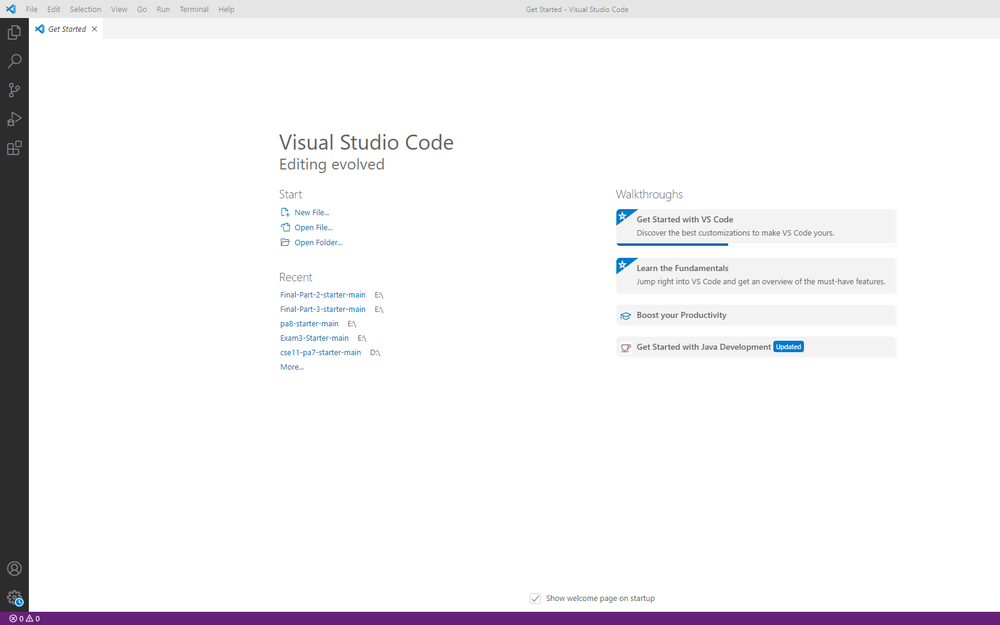

# Week 2 Lab Report

* **Installing VScode**
    Follow the instruction on VScode website and download VScode.
    [Link](https://code.visualstudio.com/)

    After installed, you should be able to open it and it looks like this:
    
    

* **Remotely Connecting**
    1. Install *OpenSSH*, which you can see from *Setting* -> *APP* -> *Apps & Features* -> *Optional Features*. Install *OpenSSH Client* and *OpenSSH Server* if you do not 
       have these on your computer.
    2. Look up for your special account for CSE15L. Change the password for your special account of CSE15L.
    3. 
* **Trying Some Commands**

* **Moving Files with scp**

* **Setting an SSH Key**

* **Optimizing Remote Running**
